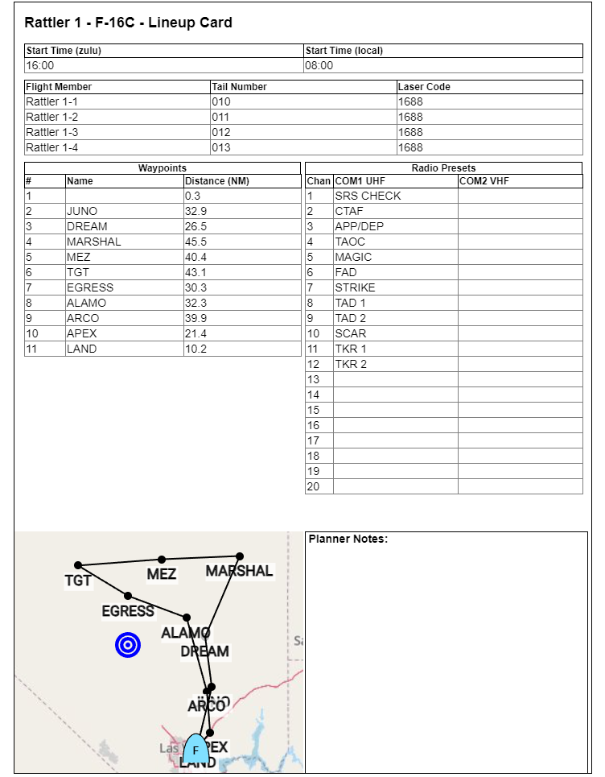
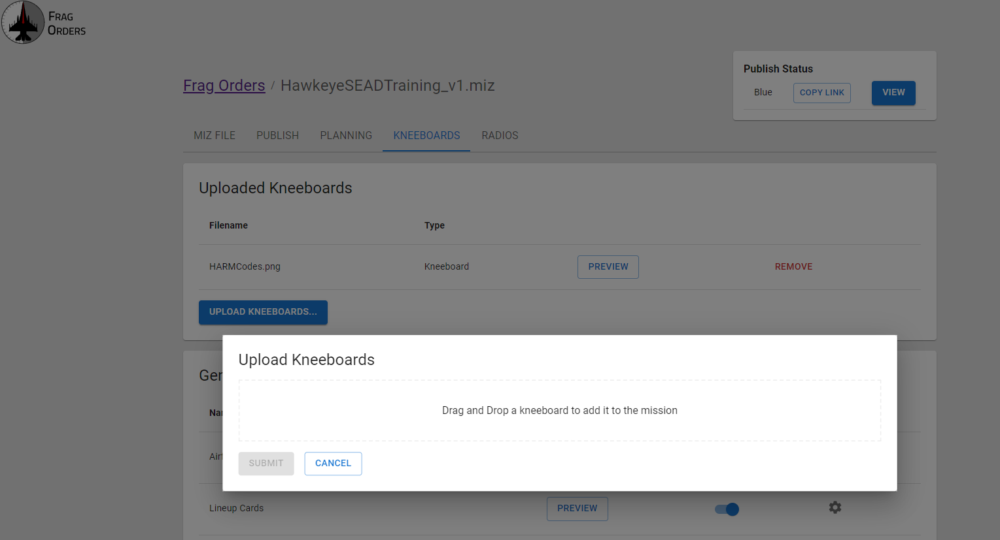

# Adding Kneeboards

## Generated Kneeboards

Frag Orders provides several kneeboard templates that can be generated straight from the data already available in your .miz file. These can be enabled from the "Kneeboards" tab. Some generated kneeboards also contain settings to control how they get rendered.

There are currently four types of generated kneeboards:

* <b>Airfield and Support Navigation Card:</b> this is a visualization of the available airfields and support assets that are in the mission. Navigation information as well as radio frequency data are automatically populated.

* <b>Lineup Cards:</b> A lineup card is a quick overview of a group's mission and contains data like radio presents, waypoint location, laser codes, etc. In addition, planners can also add more notes to the kneeboard via the [data entry](./7-planning-a-flight.md) interface.

* <b>Briefing Text</b>: This kneeboard will copy the briefing text of the mission into a kneeboard for easier access. This saves pilots from having to use the pause menu to look up important data from the mission briefing

* <b>Radio Presets Table:</b> This will render tables for the radio presets that are configured via the Radio Presets job. You can learn more about this in the [Configuring Radio Presets](./5-configuring-radios.md). This kneeboard will only be available if a Radio Preset configuration has been submitted.

An example Lineup Card:

## Uploading Kneeboards

The "Uploaded Kneeboards" section provides a simple way to add kneeboards to a .miz file and have those kneeboards displayed on the public Frag Order. This is meant to be an easier method than injecting images manually into the .miz file using a .zip editor.

Note that any kneeboards that already exist in the .miz will not be shown.

