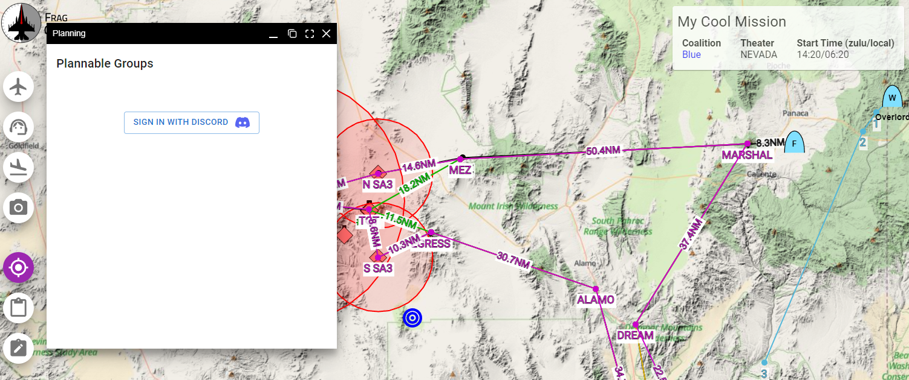
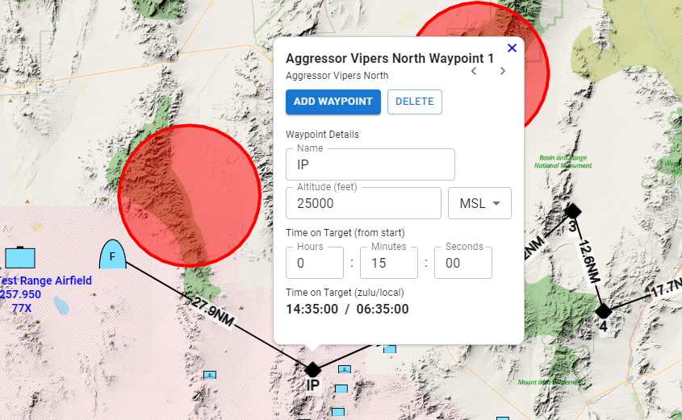
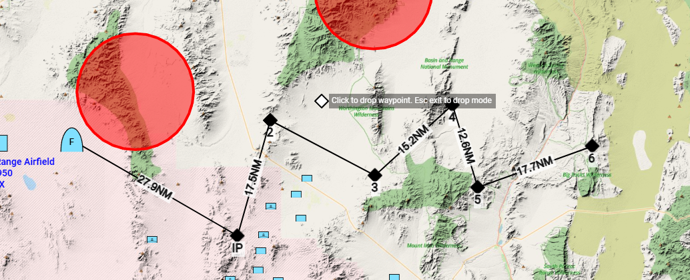
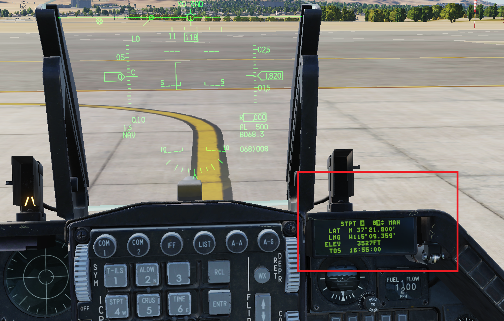
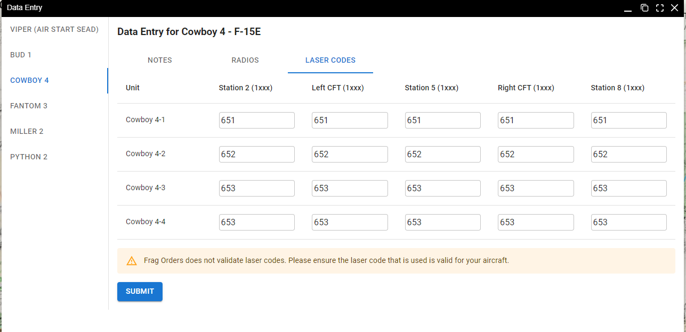
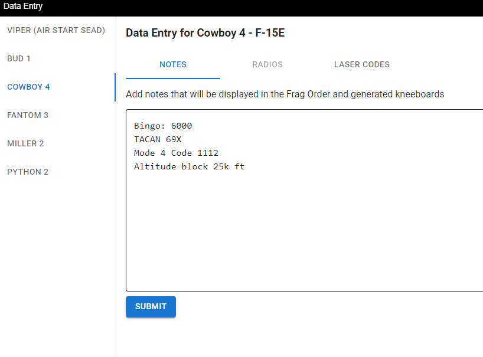
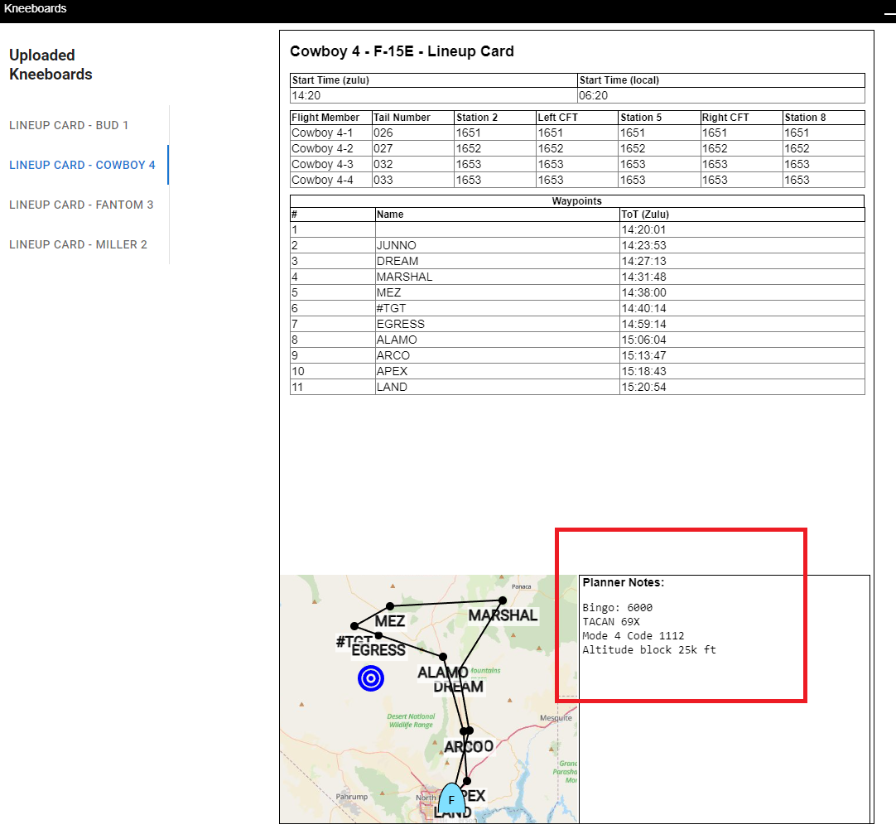

# Planning a Flight

Mission participants can plan their flight ahead of time with Frag Orders. This can allow for a much more engaging and immersive mission experience, as well as an additional challenge for veteran DCS players.

## Authenticating with Discord

To access planning features on the public frag order page, users will need to sign in via Discord. To quickly authenticate with Discord, open the Planning menu and click on the "Sign in with Discord" button.

## Adding and editing waypoints

To begin editing waypoints, click the "Planning" button to enter planning mode. While in planning mode, editable waypoints will be marked with diamonds instead of circles:

If the frag order has existing waypoints for a group. You can click and drag the waypoint to change its' location. Once you finish dragging, your plan will be automatically updated and submitted.

To edit the details of a given waypoint, left-click on the waypoint to bring up the waypoint editing dialog. From here, you can set the name of the waypoint, desired altitude, and time on target information:

To add new waypoints, click the "Add Waypoint" button. Each left-click will create a new waypoint on the route. To exit waypoint drop mode, right click your mouse or press the Escape key. While editing a waypoint, you should see a white diamond with a black border to indicate you are in waypoint drop mode:

DCS modules that support waypoint names and time-on-target input will have the respective data availabe in the aircraft, just like as if someone has set it manually in the .miz file:

## Data entry

Planners can also enter other data ahead of the mission that will be present in their aircraft. This input is managed via the "Data Entry" menu on the left side of the frag order map interface.

### Setting radio presets

Inside the "Data Entry" dialog window, click the "Radios" tab to bring up the preset entry form. Planners can input their desired frequencies that will be writting to the .miz file in their aircraft, as well as populated on any auto-generated kneeboards.

import Alert from '@mui/material/Alert'
import Box from '@mui/material/Box'
import Typography from '@mui/material/Typography'

<Box my={2}>
    <Alert style={{paddingBottom: 0 }} severity="info">
        The "Radios" will be disabled for planners if the mission creator has disabled "Allow planners to set frequencies" on the frag order administration side of the app.
    </Alert>
</Box>

The input for radio presets can be saved to file to be re-used in the future, or edited by hand. Click the "Save to File" button to export the input as a JSON file.

It is also possible to copy frequencies from an existing group. This reduces the risk of typos and cuts down on repetitive data entry. <b>Radio frequencies can only be copied between groups of the same airframe type. For example: only groups of F-16Cs can copy frequencies between each other</b>

### Setting laser codes

Planners can set laser codes for their individual flight members via the "Laser Codes" tab in the Data Entry window. Each DCS module handles laser codes in a different way, so this dialog will change based on the module of the selected group. For example, here is the laser code input for the F-15E Strike Eagle, which can have separate laser codes for each pylon:

### Adding notes

Sometimes it is useful for planners to bring extra information into a mission via the auto-generated kneeboards. The "Notes" section of the Data Entry window allows for free-form text input to be rendered on the "Lineup Card" kneeboard. The text will only show on the auto-generated Frag Orders kneeboards.

Example lineup card kneeboard:

